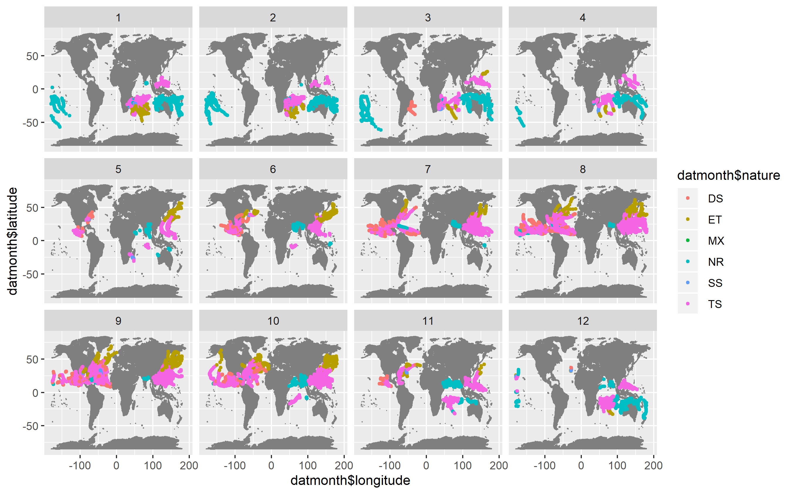

```{r setup, include=FALSE}
knitr::opts_chunk$set(echo = TRUE)
```

```{r echo = FALSE, results = "hide"}
library(dplyr)
library(readr)
library(ggplot2)
library(maps)

setwd("~/workout1/report")
colnm <- c("serial_num", "season", "num", "basin", 
           "sub-basin", "name", "iso_time", "nature",
           "latitude", "longitude", "wind", "press")
coltyp <- c("character", "integer", "character",
            "factor", "character", "character",
            "character", "character", "real",
            "real", "real", "real")
dat <- read.csv("../data/ibtracs-2010-2015.csv", 
         col.names = colnm, colClasses = coltyp,
         na = c("-999.", "0.0", "-1.0"))
```


# Workout 1: IBTRACS Storm Data Analysis
===

## Temporality: The Ebbs and Flows between Months

Looking at the map of storms by years, there is very little interesting info we can pull, other than a few correlations one would likely have to squint to see (such as the decrease in the amount of storms in the NA basin over the years).

```{r echo=FALSE, fig.align='center'}
knitr::include_graphics("../images/map-all-storms-by-year.png")
```

A bit of temporal interest arises when we go a level further, down into individual basins facetted by months. Looking at the EP and NA basins, we can see that storms seem to surge during the late summer/early autumn months, whilst dying out more or less completely in the inbetween months (seen by the lack of months 2, 3, and 4).

```{r echo=FALSE, fig.align='center'}

```

Similarly, if we look at the SI and SP basins, storm frequencies flare up in the late winter/spring months, whilst dying down in the other months.

```{r echo=FALSE, fig.align='center'}

```

On the more gradual and less spotty side of storm frequencies, we have the NI and WP basins. They have more storms in each month (with less "skips"), and their ebbs and flows are more stable than the ones seen prior. The WP basin definitely has a stronger storm presence, but besides this, their "cycles" seem to be almost the same.

```{r echo=FALSE, fig.align='center'}

knitr::include_graphics("../images/map-wp-storms-by-month.png")
```

The most interesting basin to look at both monthwise and yearwise is the SA basin, which had exactly one (1) storm of note in March of 2010 and just...never had one again the next five years.

```{r echo=FALSE, fig.align='center'}
knitr::include_graphics("../images/map-sa-storms-by-month.png")
```

---

## Hard versus Fast

```{r echo=FALSE}
fast <- dat[order(-dat$wind),]
head(fast[,c(1, 2,4,5, 6, 11, 12)], 10)
```

When we check for the ten fastest wind speeds, we find an interesting correlation; nine out of the ten fastest wind speeds are situated in the EP basin (five distinct storms, compared to the one distinct storm that took place in the NA basin).

```{r echo=FALSE}
hard <- dat[order(-dat$press),]
head(hard[,c(1, 2,4,5, 6, 11, 12)], 10)
```

For the ten hardest storm pressures, we can see a similar correlation; seven out of the ten hardest pressures are situated in the NA basin (four distinct storms compared to one distinct storm (WP)).

SO, long story short, go to the North Atlantic basin if you want to see some very fast storms, and go to the Eastern Pacific basin if you want to be extremely buffetted around by some strong storms.

---

## The Nature of Storms

```{r echo=FALSE, fig.align='center'}

```

Looking at this, one trend immediately pops out, and it should make sense near immediately too. The tropical storms (labelled in pink) all come around in the summer/autumn months (when it would get most humid), and they all congregate around the equator (the place where it would get the most humid). The most surprising part of this set of graphs to me was that these tropical storms lasted far into the late autumn/early winter months, which is definitely not when I would expect tropical storms to occur.
