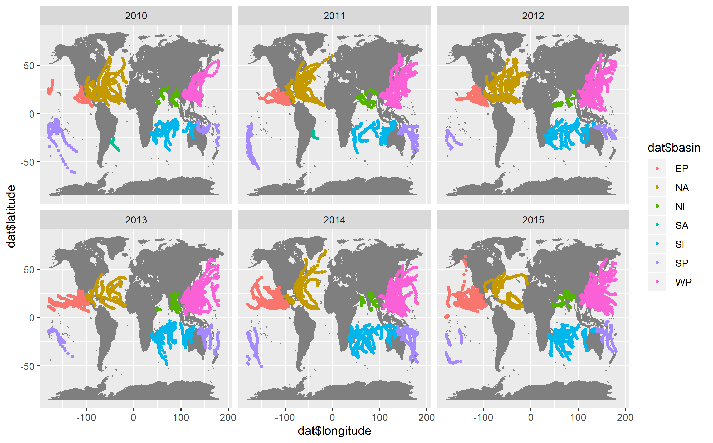
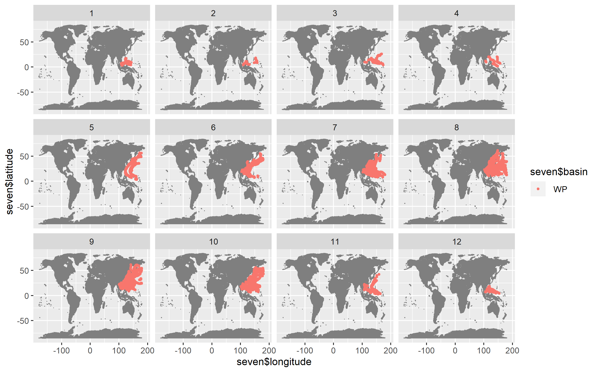
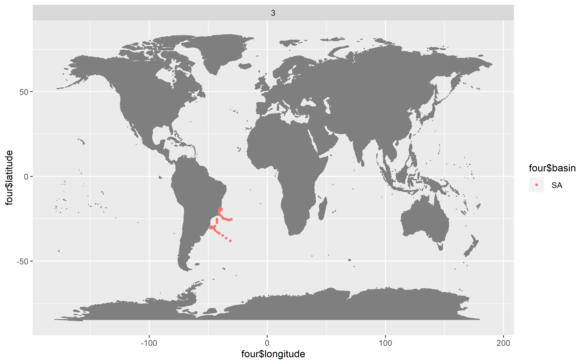

workout1-sam-na
================

    ## 
    ## Attaching package: 'dplyr'

    ## The following objects are masked from 'package:stats':
    ## 
    ##     filter, lag

    ## The following objects are masked from 'package:base':
    ## 
    ##     intersect, setdiff, setequal, union

# \# Workout 1: IBTRACS Storm Data Analysis

## Temporality: The Ebbs and Flows between Months

Looking at the map of storms by years, there is very little interesting
info we can pull, other than a few correlations one would likely have to
squint to see (such as the decrease in the amount of storms in the NA
basin over the years).

A bit of temporal interest arises when we go a level further, down into
individual basins facetted by months. Looking at the EP and NA basins,
we can see that storms seem to surge during the late summer/early autumn
months, whilst dying out more or less completely in the inbetween months
(seen by the lack of months 2, 3, and 4).

Similarly, if we look at the SI and SP basins, storm frequencies flare
up in the late winter/spring months, whilst dying down in the other
months.

On the more gradual and less spotty side of storm frequencies, we have
the NI and WP basins. They have more storms in each month (with less
“skips”), and their ebbs and flows are more stable than the ones seen
prior. The WP basin definitely has a stronger storm presence, but
besides this, their “cycles” seem to be almost the same.

The most interesting basin to look at both monthwise and yearwise is the
SA basin, which had exactly one (1) storm of note in March of 2010 and
just…never had one again the next five years.

-----

## Hard versus Fast

    ##          serial_num season basin sub.basin     name wind press
    ## 19671 2015293N13266   2015    EP        MM PATRICIA  185   872
    ## 19670 2015293N13266   2015    EP        MM PATRICIA  180   886
    ## 19672 2015293N13266   2015    EP        MM PATRICIA  180   878
    ## 19669 2015293N13266   2015    EP        MM PATRICIA  150   920
    ## 1242  2010169N13266   2010    EP        MM    CELIA  140   921
    ## 1243  2010169N13266   2010    EP        MM    CELIA  140   921
    ## 15122 2014234N12261   2014    EP        MM    MARIE  140   918
    ## 2041  2010251N14337   2010    NA        NA     IGOR  135   924
    ## 4390  2011199N10271   2011    EP        MM     DORA  135   929
    ## 14094 2014142N10254   2014    EP        MM   AMANDA  135   932

When we check for the ten fastest wind speeds, we find an interesting
correlation; nine out of the ten fastest wind speeds are situated in the
EP basin (five distinct storms, compared to the one distinct storm that
took place in the NA basin).

    ##          serial_num season basin sub.basin     name wind press
    ## 14308 2014180N32282   2014    NA        NA   ARTHUR   20  1017
    ## 14309 2014180N32282   2014    NA        NA   ARTHUR   20  1017
    ## 14310 2014180N32282   2014    NA        NA   ARTHUR   20  1017
    ## 2262  2010263N15328   2010    NA        NA     LISA   25  1016
    ## 2263  2010263N15328   2010    NA        NA     LISA   25  1016
    ## 4734  2011225N35294   2011    NA        NA FRANKLIN   25  1016
    ## 4984  2011239N27301   2011    NA        NA     JOSE   30  1016
    ## 7098  2012141N11148   2012    WP        MM    SANVU   NA  1016
    ## 7099  2012141N11148   2012    WP        MM    SANVU   NA  1016
    ## 7100  2012141N11148   2012    WP        MM    SANVU   NA  1016

For the ten hardest storm pressures, we can see a similar correlation;
seven out of the ten hardest pressures are situated in the NA basin
(four distinct storms compared to one distinct storm (WP)).

SO, long story short, go to the North Atlantic basin if you want to see
some very fast storms, and go to the Eastern Pacific basin if you want
to be extremely buffetted around by some strong storms.

-----

## The Nature of Storms

Looking at this, one trend immediately pops out, and it should make
sense near immediately too. The tropical storms (labelled in pink) all
come around in the summer/autumn months (when it would get most humid),
and they all congregate around the equator (the place where it would get
the most humid). The most surprising part of this set of graphs to me
was that these tropical storms lasted far into the late autumn/early
winter months, which is definitely not when I would expect tropical
storms to occur.
