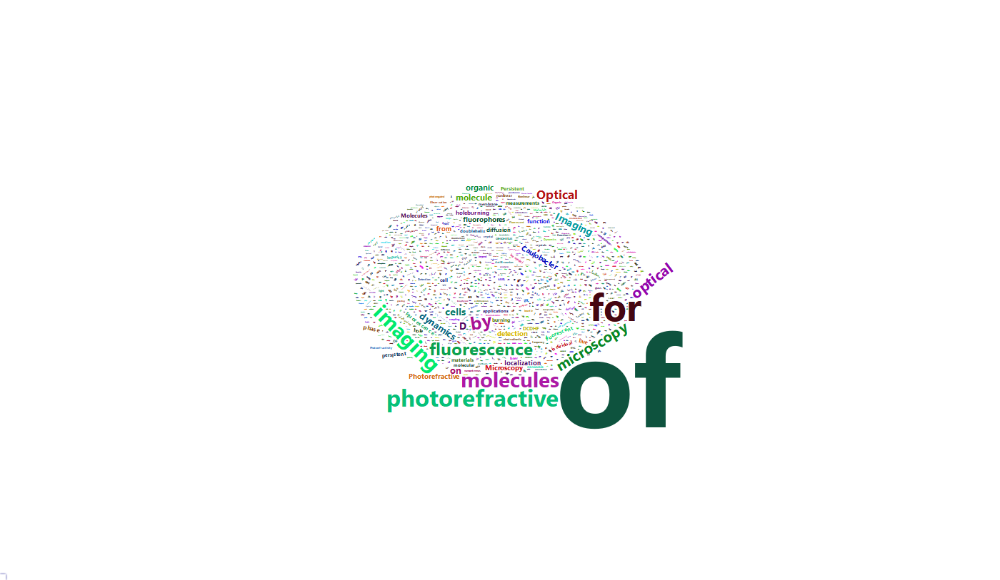
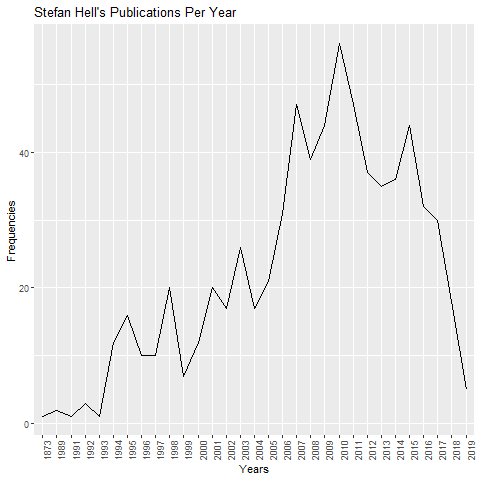
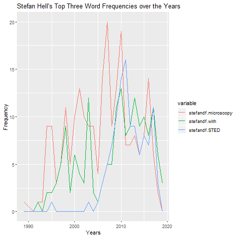

```{r setup, include=FALSE}
knitr::opts_chunk$set(echo = TRUE)
```

```{r}
library(dplyr)
library(stringr)
library(ggplot2)
library(wordcloud2)
library(webshot)
library(htmlwidgets)
library(reshape2)
```

```{r}
#Importing CSV into Manipulatable Dataframes
stefandf <- read.csv("../data/cleandata/stefan_hell_googlescholar.csv")
moernerdf <- read.csv("../data/cleandata/william_moerner_googlescholar.csv")
```

---

---

# ---Part 3---


---

---

# Number of Vowels


```{r}
#Vowels
stefanvowels <- length(stefandf[grep("^[aeiouAEIOU]", stefandf$Papers),]$Papers)
moernervowels <- length(moernerdf[grep("^[aeiouAEIOU]", moernerdf$Papers),]$Papers)
print(paste("Stefan Hell has", stefanvowels, "papers that start with a vowel and William Moerner has", moernervowels, "papers that start with a vowel. Based on initial inspection, most of these papers in both researcher's lists are words that start with vowels, not just single vowel words (like 'a' or 'I', as I initially thought)"))
```

---

# Papers that End in S


```{r}
#Ends with S
stefans <- length(stefandf[grep("[Ss]$", stefandf$Papers),]$Papers)
moerners <- length(moernerdf[grep("[Ss]$", moernerdf$Papers),]$Papers)
print(paste("Stefan Hell has", stefans, "papers that end with 's' and William Moerner has", moerners, "papers that end with an 's'. This implies that William Moerner works more with multiple objects at one time than Stefan Hell does(?)."))
```

---

# Paper Lengths


```{r}
stefandf$strlen <- str_count(stefandf$Papers)
moernerdf$strlen <- str_count(moernerdf$Papers)
maxstefan <- max(stefandf$strlen)
maxmoerner <- max(moernerdf$strlen)
print(paste("Stefan Hell longest paper name ranks in at", maxstefan, "characters and William Moerner comes in at", maxmoerner, "characters. Both are very close, meaning that either both have around the same conventions when naming papers or there is a soft cap of how long a paper name can really be."))
```

---

# Punctuation Frequency


```{r}
#Punctuation Frequency
stefandf$punctcount <- str_count(stefandf$Papers, "[[:punct:]]")
ggplot(stefandf, aes(x = punctcount)) + geom_histogram()+ggtitle("Histogram of Stefan Hell's Punctuation Frequencies")+xlab("Punctuation Count")+ylab("Frequency")
moernerdf$punctcount <- str_count(moernerdf$Papers, "[[:punct:]]")

ggplot(moernerdf, aes(x = punctcount)) + geom_histogram()+ggtitle("Histogram of William Moerner's Punctuation Frequencies")+xlab("Punctuation Count")+ylab("Frequency")

summary(stefandf$punctcount)
summary(moernerdf$punctcount)

```

### Stefan Hell's punctuation count tops out at a whopping 24 (looking at the specific title makes it seem that someone just included the names of the researchers in the title itself, leading to a bunch of commas and periods being tacked on to the total), whilst William Moerner's punctuation count tops out at a more reasonable 10.

---

# Removing Stop Words


```{r}
#Remove Stop Words
stefandf$stripped <- str_replace_all(stefandf$Papers, "\\b((?i)a(?-i))\\b|\\b((?i)the(?-i))\\b|\\b((?i)an(?-i))\\b|\\b((?i)and(?-i))\\b|\\b((?i)in(?-i))\\b|\\b((?i)if(?-i))\\b|\\b((?i)but(?-i))\\b|[[:punct:]]|[0-9]", "")
moernerdf$stripped <- str_replace_all(moernerdf$Papers, "\\b((?i)a(?-i))\\b|\\b((?i)the(?-i))\\b|\\b((?i)an(?-i))\\b|\\b((?i)and(?-i))\\b|\\b((?i)in(?-i))\\b|\\b((?i)if(?-i))\\b|\\b((?i)but(?-i))\\b|[[:punct:]]|[0-9]", "")
head(stefandf, 2)
```

---

# Top 10 Words


```{r}
#Top 10 Words for Each Researcher
listowords <- c()
for(i in stefandf$stripped){
  split <- strsplit(i, " ")
  listowords <- c(listowords, split[[1]])
}
listowords <- listowords[!listowords == ""]
stefanwordfreq <- as.data.frame(table(listowords))
head(stefanwordfreq[order(stefanwordfreq$Freq, decreasing = TRUE),], 10)

listowordm <- c()
for(i in moernerdf$stripped){
  split <- strsplit(i, " ")
  listowordm <- c(listowordm, split[[1]])
}
listowordm <- listowordm[!listowordm == ""]
moernerwordfreq <- as.data.frame(table(listowordm))
head(moernerwordfreq[order(moernerwordfreq$Freq, decreasing = TRUE),], 10)

print("Surprisingly, 'of' is both Stefen's and William's most used word (surprising in that they both have the same most used word and that the word 'of' is not considered a stop word), followed by terms that seem to be their area of expertise, like 'STED' and 'photorefractive'.")
```

---

---

# ---Part 4---

---

---

# Wordclouds


```{r eval=FALSE}

###CHANGE EVAL TO TRUE BEFORE SUBMITTING PLS###


#WordCloud
webshot::install_phantomjs()
stefanwc <- wordcloud2(stefanwordfreq)
saveWidget(stefanwc, "stef.html", selfcontained=F)
webshot::webshot("stef.html","../images/stefan_hell_wordcloud.png",vwidth = 1400, vheight = 800, delay =25)
moernerwc <- wordcloud2(moernerwordfreq)
saveWidget(moernerwc, "moer.html", selfcontained=F)
webshot::webshot("moer.html","../images/william_moerner_wordcloud.png",vwidth = 1400, vheight = 800, delay =25)
```


```{r echo=FALSE, fig.align="center"}
knitr::include_graphics("../images/stefan_hell_wordcloud.png")

```

### Based on the wordclouds, both have "of" as their most used word, but the disparity between Stefan and William in their second most used words seems to be wide (Stefan's words have a more gradual decline in size from "of" to words like "microscopy", whilst William second largest word "photorefractive" is much smaller in comparison).

---

# Publications Per Year

```{r}
#Line Plot for Publications/Year
stefyears <- as.data.frame(table(stefandf$Years))
moerneryears <- as.data.frame(table(moernerdf$Years))

png("../images/stefan_hell_publicationsperyear.png")
ggplot(stefyears, aes(Var1, Freq, group = 1))+geom_line()+xlab("Years")+ylab("Frequencies")+ggtitle("Stefan Hell's Publications Per Year")+theme(axis.text.x = element_text(angle = 90))
dev.off()

png("../images/william_moerner_publicationsperyear.png")
ggplot(moerneryears, aes(Var1, Freq, group = 1))+geom_line()+xlab("Years")+ylab("Frequencies")+ggtitle("William Moerner's Publications Per Year")+theme(axis.text.x = element_text(angle = 90))
dev.off()
```

```{r echo=FALSE, fig.align="center"}

knitr::include_graphics("../images/william_moerner_publicationsperyear.png")
```

### We can see that whilst Stefan Hell achieved the highest amount of publications published in a year (around 2010), William Moerner maintained a steady pace of around 30-35 publications a year in a time period where Stefan Hell was only sporadically reaching 20 publications (in the early 1980's).

---

# Top Three Words

```{r}
#Top Three Words
stefanthree <- c("microscopy", "with", "STED")
moernerthree <- c("single", "imaging", "molecules")
stefandf$microscopy <- as.numeric(str_detect(stefandf$Papers, "\\b((?i)microscopy(?-i))\\b"))
stefandf$with <- as.numeric(str_detect(stefandf$Papers, "\\b((?i)with(?-i))\\b"))
stefandf$STED <- as.numeric(str_detect(stefandf$Papers, "\\b((?i)STED(?-i))\\b"))
moernerdf$single <- as.numeric(str_detect(moernerdf$Papers, "\\b((?i)single(?-i))\\b"))
moernerdf$imaging <- as.numeric(str_detect(moernerdf$Papers, "\\b((?i)imaging(?-i))\\b"))
moernerdf$molecules <- as.numeric(str_detect(moernerdf$Papers, "\\b((?i)molecules(?-i))\\b"))


stefanyearswords <- data.frame(stefandf$Years, stefandf$microscopy, stefandf$with, stefandf$STED)
moerneryearswords <- data.frame(moernerdf$Years, moernerdf$single, moernerdf$imaging, moernerdf$molecules)


stefantopthree <- aggregate(stefanyearswords, list(stefanyearswords$stefandf.Years), sum)
stefantopthree <- subset(stefantopthree, select = -c(stefandf.Years))
stefantopthree <- stefantopthree[-c(1),]
moernertopthree <- aggregate(moerneryearswords, list(moerneryearswords$moernerdf.Years), sum)
moernertopthree <- subset(moernertopthree, select = -c(moernerdf.Years))

stefantopthree <- melt(stefantopthree, "Group.1")
moernertopthree <- melt(moernertopthree, "Group.1")

png("../images/stefanhelltopthreewords.png")
ggplot(stefantopthree, aes(x = Group.1))+geom_line(aes(y = value, color = variable))+xlab("Years")+ylab("Frequency")+ggtitle("Stefan Hell's Top Three Word Frequencies over the Years")
dev.off()

png("../images/williammoernertopthreewords.png")
ggplot(moernertopthree,aes(x = Group.1))+geom_line(aes(y = value, color = variable))+xlab("Years")+ylab("Frequency")+ggtitle("William Moerner's Top Three Word Frequencies over the Years")
dev.off()
```

```{r echo=FALSE, fig.align="center"}

knitr::include_graphics("../images/williammoernertopthreewords.png")
```

### We can see that Stefan's top three words are used in a more distributed manner over the years, whilst William Moerner's takes off in the 2000's, not really using those words before then.

---

---

# ---Part 5---

---

---

# Q1

```{r}
stefandf$commacount <- stefandf$Partners %>% str_count(",")
moernerdf$commacount <- moernerdf$Partners%>%str_count(",")
stefanavgpartners <- mean(stefandf$commacount)
moerneravgpartners <- mean(moernerdf$commacount)
print(paste0("Stefan Average Partner Count = ", stefanavgpartners, "| William Average Partner Count = ", moerneravgpartners))
```

### On average (using a slightly flawed but usable metric of taking one comma to mean one partner in each Partner dataframe column), both researchers have around 3 partners, with Stefan edging out William with a 0.4 partner advantage. Given such a small difference between the two, we can assume that they both have similar tolerances/reliances on how many partners they have.

---

# Q3

---

```{r}
stefandf$moerner <- stefandf$Partners %>% str_detect("\\b((?i)moerner(?-i))\\b")
moernerdf$stefan <- moernerdf$Partners%>%str_detect("\\b((?i)hell(?-i))\\b")
stefanmoerner <- stefandf%>%filter(moerner==TRUE)
moernerstefan <- moernerdf%>%filter(stefan==TRUE)

stefanmoerner$Papers
moernerstefan$Papers
```

### Stefan Hell and William Moerner have worked on a couple of papers together, including mainly ones for winning the Nobel Prize for Chemistry in 2014, optical microscopes and how they became a nanoscope, and single molecule approaches to biology. On first glance, it may seem as though William Moerner has worked on more papers with Stefan Hell than Hell has worked on with Moerner (which would be impossible), but the two extra papers that Moerner has seems to be a German version of another paper that they worked on and a logistical paper about abstract submitting, which aren't relevant.

---

# Q2

---

### Using the overlap tables created in Q3, we can see that they have a few mutual friends, such as NH Dekker, M Sauer, and K Welter, which they have both collaborated on papers together. One person of special note is E Betzig, full name Eric Betzig, who won the Nobel Prize for Chemistry alongside both Stefan and William in 2014.

---

# Q4

---

```{r}
head(stefandf[order(stefandf$commacount, decreasing = TRUE),], 2)
head(moernerdf[order(moernerdf$commacount, decreasing = TRUE),], 2)
```

### The paper with the most co-authors between these two researchers is a paper called "POSTER SESSION 2-ON BEHALF OF THE WORKING GROUP ON CARDIAC CELLULAR ELECTROPHYSIOLOGY" on Stefan Hell's article list. Based on the abstract given online, it deals with the activation of unfolded protein response (UPR), and how it might affect other cardiac ion channels other than the ones in the endoplasmic reticulum (all of which sounds extremely complicated and would befit a whopping 8 co-authors).

---

# Q5

---

```{r}
stefandf$pages <- str_match(stefandf$Journals, ", ([0-9|-]*?),")
moernerdf$pages <- str_match(moernerdf$Journals, ", ([0-9|-]*?),")
```

---

# Q9

---

```{r}
#colnames(stefandf)
#head(stefandf[order(stefandf$Citations, decreasing=TRUE),])
stefandf[stefandf$Citations == max(as.numeric(stefandf$Citations)),]
moernerdf[moernerdf$Citations == max(as.numeric(moernerdf$Citations)),]
```

